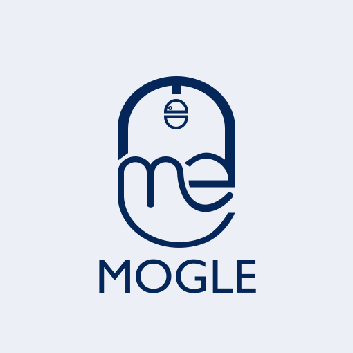

# MOGLE — Website Perkenalan Produk

Website statis satu halaman untuk MOGLE (Mouse Gesture Wireless).
Tanpa dependensi, tanpa proses build — cukup HTML, CSS, dan JavaScript biasa.

## Struktur berkas

```
Mogle/
├── index.html          # seluruh konten halaman
├── css/style.css       # seluruh styling (bernomor per bagian)
├── js/main.js          # menu mobile, scrollspy, animasi scroll
├── assets/img/
│   └── logo.svg        # PLACEHOLDER — ganti dengan logo asli
└── README.md
```

## Menjalankan

Buka `index.html` langsung di browser, atau jalankan server lokal:

```bash
python3 -m http.server 4321 --directory /Users/Shared/Mogle
```

Lalu buka <http://localhost:4321>.

## Yang masih perlu diganti

### 1. Logo

`assets/img/logo.svg` saat ini hanya pendekatan kasar dari logo MOGLE.
Timpa berkas itu dengan logo asli (pertahankan nama `logo.svg`), atau simpan
dengan nama lain lalu perbarui path-nya di `index.html` — logo dipakai di
header, footer, favicon, dan sebagai watermark pada kotak placeholder gambar.

### 2. Foto produk

Setiap kotak bergaris putus-putus adalah placeholder, ditandai atribut
`data-placeholder`. Ganti seluruh elemen `<figure>` dengan `` biasa:

```html
<!-- sebelum -->
<figure class="media media--hero" data-placeholder>
  
  <figcaption>Foto produk MOGLE</figcaption>
</figure>

<!-- sesudah -->

```

Lokasi placeholder dan rasio yang disarankan:

| Bagian     | Kelas                     | Rasio / ukuran      |
|------------|---------------------------|---------------------|
| Hero       | `.media--hero`            | 4:5 (potret)        |
| Tentang    | `.media--tall`            | 4:5 (potret)        |
| Galeri (2) | `.media--gal.media--gal-a`| lanskap, ±3:2       |
| Galeri (2) | `.media--gal.media--gal-b`| lanskap, ±4:3       |

Simpan gambar di `assets/img/`. Gunakan WebP atau JPG terkompresi agar ringan.

### 3. Kontak (opsional)

Kontak yang terpasang: Instagram [@moglein.aja](https://www.instagram.com/moglein.aja),
muncul di bagian `#kontak` dan di footer `index.html`.

Email dan domain `www.mogle.com` sudah dihapus karena belum ada yang resmi.
Bila nanti tersedia, tambahkan sebagai `<li>` baru di daftar kontak footer dan
sebagai tombol kedua (`btn btn--outline`) di `.cta__actions`.

## Menyesuaikan warna

Semua warna terpusat di blok `:root` pada `css/style.css`. Warna utama
`--navy-800: #062a5e` diambil dari logo. Mengubah satu nilai itu akan
memperbarui tombol, judul, kartu gelap, dan footer sekaligus.

## Catatan teknis

- **Breakpoint:** 1024px (tablet), 860px (menu jadi hamburger), 720px (ponsel).
- **Animasi scroll** memakai `IntersectionObserver`. Elemen disembunyikan hanya
  jika kelas `js` ada pada `<html>`, sehingga konten tetap terbaca bila
  JavaScript gagal dimuat.
- **`prefers-reduced-motion`** dihormati: semua animasi dimatikan bagi pengguna
  yang mengaktifkannya.
- **Font** Plus Jakarta Sans dimuat dari Google Fonts. Untuk membuat situs
  sepenuhnya offline, unduh fontnya ke `assets/` dan ganti `<link>` di `<head>`
  dengan aturan `@font-face`.
